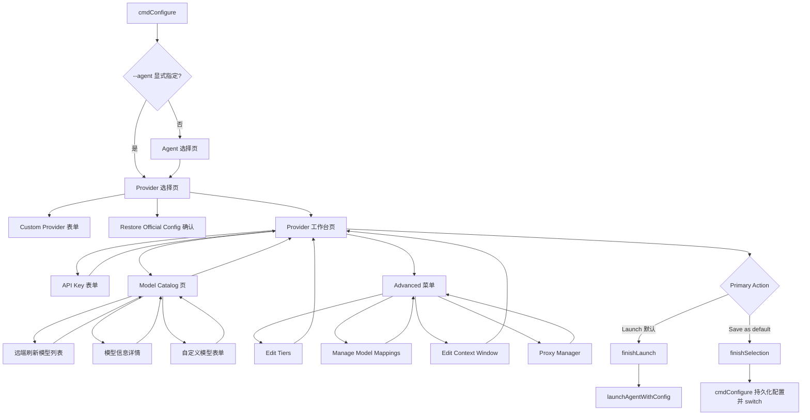

# TUI Launch-first 重构计划

## 背景与目标

目标是重新设计 `cs configure` 的 TUI 第一屏交互，让用户先选择 provider，再在 provider 详情中完成 API key、模型、模型信息查看等配置，并默认以 **launch** 方式临时启动 agent。默认路径应通过环境变量注入启动 `codex`、`claude`、`opencode`，避免侵入本地配置；只有用户明确选择持久化时才写入本地 agent 配置。

本计划只描述重构，不修改现有代码。

---

## 当前 TUI 代码结构理解

### `tui.go`

核心职责：`configure` 命令的 TUI/文本 fallback 入口、provider 列表页、provider 详情页、模型选择页、API key 表单、自定义 provider、agent 选择、最终 `ConfigureSelection` 输出。

关键函数与结构：

- `cmdConfigure(args, in, out)`
  - 解析 `--agent`、目录 override、`--reset-key`、`--dry-run`。
  - 加载 `AppConfig`。
  - 读取当前 agent 的已配置 provider/model。
  - TTY 环境下调用 `runArrowTUI`，否则调用 `promptConfigureSelectionFallback`。
  - TUI 返回 `ConfigureSelection` 后：
    - 如 `selection.Launch`，调用 `launchAgentWithConfig`。
    - 否则写入 app config，再调用 `switchProvider` / `switchCodexProvider` / `switchOpencodeProvider` 或跨协议 proxy switch。
- `tuiState`
  - 保存 TUI 会话态：当前 agent、当前 provider/model、页面、provider 列表、临时输入的 API key、reset flags、自定义 model、tier overrides、最终结果等。
- `runArrowTUI(...)`
  - 初始化 `tview.Application` / `tview.Pages` / `tuiState`。
  - 创建 provider list 页面。
  - 若 `selectAgent == true`，先显示 `showAgents()`；否则直接 `showProviders()`。
- `showAgents()`
  - 选择 `claude` / `codex` / `opencode` 后刷新当前配置，再进入 provider 列表。
- `showProviders()` / `rebuildProviderList()`
  - 第一主页面是 provider 列表。
  - provider 列表混合显示：内置 provider、自定义 provider 入口、restore 入口。
  - 每项展示 provider title、协议 badges、direct/proxy mode、当前/已保存 key 等状态。
- `showDetail(provider, backPage)`
  - 当前 provider 的主操作中心。
  - 展示 provider 信息、endpoint、当前连接模式、key 状态、context window 等。
  - 动作包括：`Choose Model`、`Use Model`、`Manage Model Mappings`、`Proxy Manager`、`Launch`、`Set as default`、`Edit API Key`、`Edit Context Window`、`Edit Tiers`、`Back`。
- `showModels(provider, backPage)`
  - 展示模型列表，支持 `/` 过滤、`c` 自定义模型、`k` 编辑 key、`r` 刷新、`1` 切换 `[1m]` 后缀。
  - 选择模型后进入 `selectModelForAction`。
- `selectModelForAction(provider, backPage, model)` / `showModelActions(...)`
  - 若缺 key，先要求输入 key。
  - 再进入模型动作页，当前行为是选择 `Launch` 或 `Set as default`。
  - 现有逻辑对 `claude` 隐藏模型动作页中的 `Launch`。
- `finishSelection(provider, model)` / `finishLaunch(provider, model)`
  - 组装最终 `ConfigureSelection`。
  - `finishLaunch` 在 `finishSelection` 基础上设置 `Launch=true`。

### `tui_launch.go`

核心职责：用临时环境变量启动 agent，不永久修改本地 agent 配置。

关键函数：

- `launchAgent(agent, provider, modelOverride, apiKeyFlag, out)`
  - CLI launch 入口，解析 provider/key 后委托给 `launchAgentWithConfig`。
- `launchAgentWithConfig(agent, provider, modelOverride, apiKey, cfg, configPath, out)`
  - 解析 provider preset。
  - `resolveConnection(..., "auto")` 决定 direct/proxy。
  - `adjustLaunchConnectionPlan` 处理 opencode direct launch 的 OpenAI Chat endpoint 偏好。
  - `launchEnvPairsForPlan` 生成启动环境变量。
  - `codex` 额外准备临时 `CODEX_HOME`。
  - `lookPath(agent)` 后调用 `launchCommand` 启动真实 agent。
- `launchEnvPairs(...)`
  - `claude` 注入 `ANTHROPIC_BASE_URL`、API key env、model/tier/env extras。
  - `codex` / `opencode` 注入 `OPENAI_BASE_URL`、`OPENAI_API_KEY`、`OPENAI_MODEL`。
- `launchEnvPairsForPlan(...)`
  - direct 模式直接生成 env。
  - proxy 模式调用 `configureTemporaryProxyRoute`，把 agent 指向本地 proxy base URL。
- `configureTemporaryProxyRoute(...)`
  - 临时写入 proxy route、启动/复用 proxy daemon，并在 launch 结束后恢复原始 app config / codex config。

### `tui_proxy.go`

核心职责：provider detail 里的 proxy manager、model mapping、use model、context window 等辅助页面。

关键函数：

- `providerDetailActionLabels(...)`
  - detail 页动作标签的单一字符串来源。
- `showUseModelForm(provider)`
  - 表单输入模型并持久化 provider 默认模型 + default model mapping。
- `showModelMappings(provider)` 及相关 helper
  - 查看/编辑 client-model 到 provider-model 的映射。
- `showContextWindowForm(provider)`
  - Codex context window override。
- `showProxyManager(provider)` / `showProxyManagerForAgent(provider, agent)`
  - proxy route 管理入口，支持切换 active agent、configure/delete/start/stop/status/preview。
- `proxyRouteFormDefaults` / `proxyRouteFormApplyAgent` / `proxyRouteFormSubmitArgs` / `proxyRouteFormSaveResult`
  - route 表单的纯函数测试面。
- `showProxyRouteForm(provider, agent)`
  - 配置指定 agent 的 proxy route。

---

## 当前流程与目标流程差异

### 当前流程

```text
cmdConfigure
  ├─ 可选 Agent 选择页（未显式 --agent 时）
  └─ Provider 列表页（第一主页面）
       ├─ custom provider 表单
       ├─ restore 确认页
       └─ Provider 详情页
            ├─ Choose Model → 模型列表 → 模型动作页 → Launch / Set as default
            ├─ Use Model → 直接持久化默认模型
            ├─ Edit API Key
            ├─ Edit Tiers / Edit Context Window
            ├─ Manage Model Mappings
            ├─ Proxy Manager
            ├─ Launch（使用 preset.Model）
            └─ Set as default（使用 preset.Model）
```

当前问题：

1. provider detail 是动作中心，但默认意图仍偏“配置/切换”，launch 只是其中一个动作。
2. 选模型后才出现 launch/set default，且 `claude` 模型动作页当前隐藏 launch；这与“默认 launch 所有 agent”的目标不一致。
3. 远端模型列表能力分散在 `presets.go` / `agent.go`，目前只覆盖 Ollama 与 OpenRouter，且只返回 model ID 列表，没有统一模型信息结构。
4. 模型刷新是同步列表重建，没有显式展示“远端拉取成功/失败/使用内置 fallback”的状态。
5. `Use Model` 直接持久化，与新目标中的“选定模型后可 launch 或持久化配置”重复且语义不够清晰。

### 目标流程

```text
cmdConfigure
  ├─ 可选 Agent 选择页（保持现有 --agent 语义）
  └─ Provider 选择页（第一屏：只做 provider 决策）
       ├─ custom provider 表单
       ├─ restore 确认页
       └─ Provider 工作台页
            ├─ API Key 区
            │    ├─ 输入/更新 session key
            │    └─ 保存 key（可选，或在持久化时保存）
            ├─ Model 区
            │    ├─ 加载内置模型列表
            │    ├─ 拉取远端模型列表/模型信息
            │    ├─ 搜索/过滤
            │    ├─ 查看模型信息
            │    └─ 自定义模型
            ├─ Advanced 区
            │    ├─ tier mappings
            │    ├─ model mappings
            │    ├─ context window
            │    └─ proxy manager
            └─ Primary Actions
                 ├─ Launch（默认高亮，临时 env 注入，不写本地 agent 配置）
                 └─ Save as default（明确持久化 app config + agent config）
```

核心差异：

- 第一屏仍是 provider，但 provider 入口后不再以“动作菜单”为主，而是以“provider 工作台/配置页”为主。
- 默认 action 从“进入详情后自行选择动作”改为“选 provider → 配 key/model → Launch”。
- 模型列表从静态 preset list 升级为统一的 model catalog：支持静态、远端拉取、fallback、模型元信息。
- Launch 要覆盖 `claude` / `codex` / `opencode`，并成为模型选择后的默认动作。
- 持久化要成为显式次要动作，避免无意修改本地配置。

---

## 新页面流程图



建议的键位/动作：

- Provider 选择页：`Enter/→` 进入工作台，`/` 过滤 provider，`q/esc` 退出。
- Provider 工作台页：`Enter` 或 `l` 默认 Launch，`s` Save as default，`k` API key，`m` model catalog，`a` advanced，`b/←` 返回 provider。
- Model Catalog 页：`Enter` 选择模型并返回工作台，`l` 选择并 launch，`s` 选择并保存默认，`i` 查看模型信息，`r` 远端刷新，`c` custom，`/` filter，`b/esc` 返回工作台。

---

## 需要修改的文件和函数

### 1. `tui.go`

#### `tuiState`

新增会话态字段：

- `selectedModel string`：provider 工作台当前选定模型。
- `modelCatalogs map[string]ModelCatalogState`：每个 provider 的模型 catalog 缓存。
- `modelFetchStatus map[string]string` 或状态枚举：展示远端拉取状态。
- `sessionAPIKey(provider)` helper：统一读取 `typedAPIKeys`、stored key、NoAPIKey provider 的临时 key。

目的：让 provider 工作台拥有明确的 provider + model + key 状态，而不是在 `showDetail`、`showModels`、`showModelActions` 之间隐式传递。

#### `showProviders()` / `rebuildProviderList()`

保留作为第一屏，但建议：

- 标题改成 `Select Provider`，弱化“configured/unconfigured 混合列表”的感觉。
- secondary text 显示：连接模式、是否需要 key、是否支持远端模型列表。
- 选择 provider 后进入新的 `showProviderWorkspace(provider)`，替代直接进入旧 `showDetail`。

#### 新增 `showProviderWorkspace(provider string)`

替代 `showDetail` 成为 provider 入口后的主页面。

页面布局建议：

```text
Provider: OpenRouter                 Agent: codex
Connection: proxy/openai-chat        Key: saved/session/missing
Selected model: anthropic/claude-sonnet-4.6
Model source: remote 314 models, refreshed 12:30:02

[ Launch (default) ]
[ Save as default ]
[ Models... ]
[ Edit API Key ]
[ Advanced... ]
[ Back ]
```

行为：

- 进入时解析 preset、key 状态、默认模型。
- 若 provider 需要 key 且没有 saved/session key，允许用户直接进 key 表单；但不强制阻断浏览模型 catalog，除非远端拉取需要 key。
- `Launch`：如缺 key，先打开 key 表单，保存 session key 后回 workspace 并继续 launch 或让用户再次确认；第一阶段建议“不自动继续”，降低误启动。
- `Save as default`：调用现有 `finishSelection`，持久化逻辑仍由 `cmdConfigure` 完成。

#### `showDetail(provider, backPage)`

建议改造路径：

- 第一阶段保留函数作为 advanced/detail-only 页面，避免一次性删除大量测试依赖。
- 或让 `showDetail` 内部调用 `showProviderWorkspace`，再把原详情文本迁移为 `showProviderInfo(provider)`。

推荐：新增 `showProviderInfo(provider, backPage)` 承载原 `providerDetailInfoText` + 只读信息；`showProviderWorkspace` 作为新入口。

#### `showModels(provider, backPage)`

改造成 Model Catalog 页：

- 数据源从 `ts.buildModels(provider)` 改为 `ts.modelCatalog(provider)`。
- 列表项显示 model ID，secondary text 显示 context length、输入/输出价格、能力标签等（有则显示，无则为空）。
- `r` 调用远端 fetch，并将错误/fallback 状态显示在页面上。
- `i` 打开 `showModelInfo(provider, modelID)`。
- 选择模型默认“选中并返回 workspace”，而不是必须进入 action page。
- 保留 `l` / `s` 快捷键，支持从模型页直接 launch 或持久化。

#### `selectModelForAction` / `showModelActions` / `runModelSelectionAction`

建议逐步废弃 `showModelActions`：

- 第一阶段可以保留测试覆盖，但新流程不再依赖。
- 新增 `selectModel(provider, model)`：设置 `ts.selectedModel` / `ts.customModels[provider]` 后返回 workspace。
- 新增 `launchSelectedProvider(provider)`：缺 key 时转 key 表单，否则 `finishLaunch(provider, selectedModel)`。
- 新增 `saveSelectedProvider(provider)`：缺 key 时转 key 表单，否则 `finishSelection(provider, selectedModel)`。

#### `showKeyFormWithCancel(...)`

扩展以支持“保存 session key 后回 workspace”的场景：

- 保留现有签名可行。
- 新增小 helper：`showKeyFormForWorkspace(provider, afterSave func())`，避免在 workspace 中重复 closure。
- 不要在 launch 默认路径中写 app config；只把 key 存在 `ts.typedAPIKeys[provider]`，最终由 `ConfigureSelection.APIKey` 传给 `launchAgentWithConfig`。

#### `promptConfigureSelectionFallback(...)`

文本 fallback 也要对齐语义：

- 仍然先选择 provider。
- 询问 model 后新增动作选择：默认 `[L]aunch`，可输入 `s` 保存默认。
- 缺 key 时依旧通过 `cmdConfigure` 后续 `promptAPIKey` 获取。
- 如果用户直接回车，返回 `ConfigureSelection{Launch:true}`。

### 2. `tui_launch.go`

主要保留现有 launch 实现，计划只做边界修正：

- 确认 `launchAgentWithConfig` 支持 `agentClaude`，并去掉 TUI 层对 Claude launch 的隐藏限制。
- 增加测试覆盖：TUI 返回 `Launch=true` + Claude 时调用 launch 路径。
- 若模型来自远端 catalog 且不在 preset `Models` 中，确保 `resolveAgentSwitchPreset(..., modelOverride)` / `withSelectedModel` 能接受自定义模型并正确注入 env。
- 保持 proxy launch 的临时 config 恢复机制不变。

### 3. `tui_proxy.go`

需要调整的是入口关系而非 proxy manager 本身：

- `providerDetailActionLabels` 增加或重排动作标签，反映新 workspace/advanced 结构。
- `showUseModelForm` 可降级为 advanced 功能，或由 `Save as default` 替代。
- `showModelMappings`、`showContextWindowForm`、`showProxyManager` 保持页面实现，但返回目标改为 `showProviderWorkspace` 或 `showAdvancedMenu`。
- 新增 `showAdvancedMenu(provider)`：聚合原 detail 中不属于主路径的功能。

### 4. `presets.go` / `agent.go`

需要引入统一模型 catalog API，而不是继续散落 provider 特判。

建议新增文件：`model_catalog.go`。

现有相关函数：

- `discoverOllamaModels()`：只返回 `[]string`。
- `discoverOpenRouterModels(apiKey)`：只返回 `[]string`。
- `openRouterModelsWithAPIKey(cfg, apiKey)`：OpenRouter 特判。
- `providerModels(cfg, provider)` / `providerModelsForAgentWithAPIKey(...)`：静态/动态模型列表入口。

重构方向：

- `providerModels*` 继续作为兼容 wrapper，只返回 `[]string`。
- 新的 TUI model catalog 使用 `FetchProviderModels` 返回结构化模型信息。

---

## 新增功能点

### 1. Provider 工作台页

- 进入 provider 后在一个页面展示：provider、agent、连接模式、API key 状态、选定模型、模型来源。
- 默认动作为 Launch。
- 持久化配置是显式次要动作。
- Advanced 功能从主路径中折叠。

### 2. 统一模型 catalog

- 支持静态 preset 模型、远端模型列表、模型信息、fallback。
- 支持显示模型信息：context length、价格、能力、描述等，按 provider 能提供的字段渐进增强。
- 支持缓存与刷新状态。

### 3. 远端模型拉取

第一阶段建议支持：

- OpenRouter：`GET https://openrouter.ai/api/v1/models`。
- Ollama：`GET http://localhost:11434/api/tags`。
- DeepSeek：如官方 OpenAI-compatible `/models` 可用，则 `GET https://api.deepseek.com/v1/models`；失败时 fallback 到 preset models。

后续可扩展：Zhipu、Volcengine、MiniMax、OpenAI-compatible custom provider。

### 4. 模型信息页

- 在模型列表中按 `i` 查看当前模型信息。
- 信息字段按 provider 返回填充；缺失字段显示 `unknown` 或不显示。

### 5. Launch-first 行为

- provider workspace 中 `Enter` / `l` 默认 launch。
- 模型 catalog 中选择模型默认返回 workspace；`l` 可直接 launch。
- `claude` 也允许 launch。
- launch 路径只用 `ConfigureSelection.APIKey` + env 注入，不写本地 agent 配置。

### 6. Save as default 显式持久化

- `s` 或按钮触发 `finishSelection`。
- 仍沿用 `cmdConfigure` 里的 app config 保存和 agent switch 逻辑。
- 若需要 key，则持久化时保存 key。

---

## 需要新增的 API / 数据结构

建议新增 `model_catalog.go`。

### 数据结构

```go
type ProviderModelInfo struct {
    ID            string
    Name          string
    Description   string
    ContextWindow int
    MaxOutput     int
    InputPrice    string
    OutputPrice   string
    Capabilities  []string
    RawProvider   string
}

type ProviderModelCatalog struct {
    Provider string
    Source   string // "static", "remote", "fallback"
    Models   []ProviderModelInfo
    Err      string
}

type ModelCatalogFetcher interface {
    FetchModels(provider string, preset ProviderPreset, apiKey string) ProviderModelCatalog
}
```

### 函数 API

```go
func providerModelCatalog(cfg *AppConfig, agent AgentName, provider, apiKey string) ProviderModelCatalog
func staticModelCatalog(provider string, preset ProviderPreset) ProviderModelCatalog
func fetchOpenRouterModelCatalog(apiKey string) ProviderModelCatalog
func fetchOllamaModelCatalog() ProviderModelCatalog
func fetchOpenAICompatibleModelCatalog(endpoint ProtocolEndpoint, apiKey string) ProviderModelCatalog
func modelIDs(catalog ProviderModelCatalog) []string
```

设计原则：

- TUI 调用 `providerModelCatalog`，不直接关心 provider 特判。
- 任何远端失败都返回 `Source: "fallback"` + 静态 preset models + `Err`，不让 TUI 空白。
- `providerModels` / `providerModelsForAgentWithAPIKey` 可基于 `modelIDs(providerModelCatalog(...))` 逐步迁移。
- 所有网络请求使用短 timeout（沿用 3s 或可配置），不可阻塞 TUI 太久。

### OpenRouter 响应建议解析字段

OpenRouter `/api/v1/models` 当前已存在 `data[].id`，可扩展解析：

- `name`
- `description`
- `context_length`
- `pricing.prompt`
- `pricing.completion`
- `supported_parameters`

缺失字段不影响列表展示。

### DeepSeek / OpenAI-compatible `/models`

建议通用解析：

```json
{
  "data": [
    { "id": "deepseek-chat", "object": "model", "owned_by": "deepseek" }
  ]
}
```

只有 `id` 时仍可组成 `ProviderModelInfo{ID: id}`。

---

## 分阶段实施计划

### Phase 1：页面流程重排（不引入新网络 API）

目标：先把 TUI 从 detail-action-first 改成 workspace-launch-first，模型仍用现有 `providerModels*`。

1. 新增 `showProviderWorkspace(provider)`。
2. Provider list 选择后进入 workspace。
3. Workspace 显示现有 provider detail 摘要和 selected model。
4. 新增 `launchSelectedProvider` / `saveSelectedProvider`。
5. 取消 `claude` 模型动作中隐藏 Launch 的限制，或让新流程绕过旧 `showModelActions`。
6. 保留旧 `showDetail` 作为 provider info/advanced 兼容页。
7. 更新文本 fallback 默认 `Launch=true`。

### Phase 2：统一模型 catalog 结构

目标：引入结构化 catalog，但先只用静态数据和现有 Ollama/OpenRouter能力。

1. 新增 `model_catalog.go`。
2. 实现 `staticModelCatalog`。
3. 包装现有 `discoverOllamaModels` / `discoverOpenRouterModels` 为 catalog fetcher。
4. `showModels` 改用 `ProviderModelCatalog`。
5. Model info 页展示结构化字段。
6. 保持 `providerModels*` wrapper 兼容测试。

### Phase 3：远端刷新与错误状态

目标：让 TUI 明确支持拉取模型列表和展示信息。

1. 在 `tuiState` 增加 catalog cache/status。
2. `showModels` 进入时加载 catalog。
3. `r` 触发刷新并更新 source/err 文案。
4. 缺 key 的 provider 远端刷新时提示先输入 key。
5. 网络失败时显示 fallback 提示，不中断流程。

### Phase 4：Provider-specific 增强

目标：扩展更多 provider 的远端模型能力。

1. OpenRouter 解析模型信息字段。
2. DeepSeek OpenAI-compatible `/models`。
3. 对 custom provider：如 protocol 是 openai-chat/openai-responses，尝试 `${baseURL}/models` 或配置专用 model list URL；第一阶段建议只对 known providers 做远端。
4. 为更多 provider 添加 fetcher 时保持失败 fallback。

---

## 测试策略

### 单元测试

新增/更新测试文件建议：

- `tui_workspace_test.go`
  - workspace 动作标签顺序：Launch 默认在首位，Save as default 次之。
  - 缺 key 时 launch 进入 key 表单，不直接结束。
  - 有 saved key 时 `launchSelectedProvider` 产生 `ConfigureSelection{Launch:true}`。
  - `saveSelectedProvider` 产生 `Launch:false`。
  - Claude workspace 也显示 Launch。
- `tui_model_catalog_test.go`
  - `showModels` 使用 catalog source/status。
  - 选择模型后更新 `ts.selectedModel` 并返回 workspace。
  - `r` refresh 失败时显示 fallback status。
  - `i` 打开 model info 页。
- `model_catalog_test.go`
  - static catalog 从 preset `Models` / `Model` 生成。
  - OpenRouter catalog 解析 id/name/context/pricing。
  - OpenAI-compatible `/models` 解析 id。
  - 远端非 200 / JSON 错误时 fallback。
  - 无 API key 时需要 key 的 provider 不发请求并 fallback。
- 更新现有测试：
  - `tui_model_actions_test.go`：如保留旧函数，调整 Claude Launch 预期；如废弃路径，则迁移到 workspace 测试。
  - `task5_final_review_test.go` / `task5_tui_test.go`：provider detail action labels 变化需要同步。
  - `main_test.go` 的 TUI flow integration：provider 选择后的 front page 由 `detail` 改为 `provider-workspace`。
  - `tui_launch_test.go`：增加 Claude TUI launch 选择覆盖。

### 网络测试策略

- 不在测试中访问真实网络。
- 为 fetcher 注入 `*http.Client` 或 package-level `modelCatalogHTTPClient`，测试使用 `httptest.Server`。
- OpenRouter/DeepSeek/Ollama 分别用 fixture JSON。
- timeout 行为只测试“错误 fallback”，不做真实等待。

### 集成/回归验证

每次代码实现后按仓库要求运行：

```bash
go vet ./... && go test ./... && go build -o cs .
```

建议额外手动验证：

1. `cs configure --agent codex`：选择 OpenRouter → 输入 key → 刷新模型 → launch。
2. `cs configure --agent claude`：选择 DeepSeek → 选择模型 → launch，确认不改 `~/.claude/settings.json`。
3. `cs configure --agent opencode`：选择 OpenRouter/DeepSeek → launch。
4. `cs configure --agent codex`：Save as default，确认 app config 和 agent config 被持久化。
5. 断网或错误 key：模型列表 fallback 到 preset，TUI 不崩溃。

---

## 风险与注意事项

1. **不要破坏 launch 临时性**
   - `Launch` 路径必须只通过 `launchAgentWithConfig` 和环境变量/临时 proxy route 工作。
   - 不应调用 `switchProvider` 系列持久化函数。

2. **API key 处理要清晰**
   - session key 用 `ts.typedAPIKeys`。
   - saved key 从 agent-aware config 读取。
   - Save as default 才持久化 key。

3. **远端模型拉取不可阻塞体验**
   - 设置短 timeout。
   - 失败 fallback。
   - 页面展示 source/error。

4. **保持 protocol/proxy 决策不重复实现**
   - workspace 只展示 `resolveConnection` 结果。
   - launch/switch 仍复用现有 `resolveConnection`、`launchEnvPairsForPlan`、`configureProxyRouteForCrossProtocolSelection`。

5. **避免一次性删除旧页面导致测试大面积失效**
   - 先新增 workspace 并迁移入口。
   - 再逐步降级/移除旧 detail/model actions。

---

## 推荐最终文件职责

- `tui.go`
  - TUI entrypoint、provider list、provider workspace、key/model/basic navigation。
- `tui_models.go`（可选新增）
  - model catalog 页、model info 页、custom model 表单。
- `model_catalog.go`（新增）
  - provider model catalog 数据结构、fetcher、fallback。
- `tui_proxy.go`
  - advanced pages：proxy manager、model mappings、use model/context/tier 相关页面。
- `tui_launch.go`
  - launch env/proxy lifecycle，不承担 TUI 页面逻辑。

如果希望控制重构风险，优先只新增 `model_catalog.go`，暂不拆 `tui_models.go`；等行为稳定后再做文件拆分。

---

## 完成标准

1. TUI 第一主页面是 provider 选择。
2. 进入 provider 后可配置 API key、模型、advanced 选项。
3. 支持远端模型列表/模型信息拉取，失败可 fallback。
4. 选定模型后可 launch 或 Save as default。
5. 默认 action 是 launch，且 `claude` / `codex` / `opencode` 都支持。
6. Launch 路径不修改本地 agent 配置。
7. 所有新增/更新测试通过，且 `go vet ./... && go test ./... && go build -o cs .` 通过。
